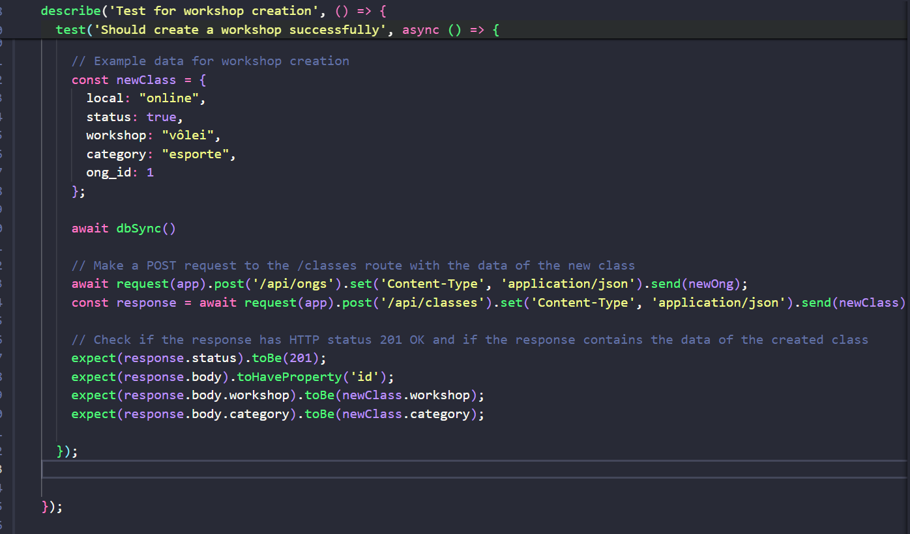

# Caso-de-Teste-de-Software

## Autora: 

<a href="https://www.linkedin.com/in/anna-aragao/"> Anna Aragão </a>

## Sumário

- [Caso-de-Teste-de-Software](#caso-de-teste-de-software)
  - [Autora:](#autora)
  - [Sumário](#sumário)
- [1. Introdução](#1-introdução)
- [2. Descrição](#2-descrição)
- [3. Propósito](#3-propósito)
- [4. Pré-condição](#4-pré-condição)
- [5. Procedimento de teste](#5-procedimento-de-teste)
- [6. Resultado Esperado](#6-resultado-esperado)
- [7. Resultados que podem indicar erro](#7-resultados-que-podem-indicar-erro)
- [8. Resultado obtido](#8-resultado-obtido)
- [9. Pós-condição](#9-pós-condição)
- [10. Código do Teste](#10-código-do-teste)
- [11. Conclusão](#11-conclusão)
  
# 1. Introdução 

&nbsp;&nbsp;&nbsp;&nbsp;O teste de software automatizado é uma prática essencial na garantia da qualidade de software, onde os testes são executados de forma automatizada por meio de scripts ou ferramentas específicas. 

&nbsp;&nbsp;&nbsp;&nbsp;Ao contrário dos testes manuais, os casos de teste automatizados permitem a verificação e validação rápida e eficiente de funcionalidades do software, garantindo a conformidade com os requisitos pré-estabelecidos. 

&nbsp;&nbsp;&nbsp;&nbsp;Os casos de testes automatizados oferecem uma série de benefícios como a eficiência e economia de tempo, realização de uma grande quantidade de testes em pouco tempo, detecção precoce de defeitos e outros benefícios. 

&nbsp;&nbsp;&nbsp;&nbsp;Sendo assim, os testes automatizados são cruciais para o desenvolvimento ágil, permitindo a rápida detecção de falhas e a entrega contínua de software de alta qualidade. 

# 2. Descrição 

&nbsp;&nbsp;&nbsp;&nbsp;Este teste automatizado verifica a funcionalidade de criação de workshops através da rota api/classes. O teste envia uma solicitação HTTP POST com dados de exemplo para a criação de uma nova classe e verifica se a resposta retorna o status HTTP 201 OK.

# 3. Propósito 
&nbsp;&nbsp;&nbsp;&nbsp;O propósito do teste é validar a integridade e a funcionalidade da rota api/classes responsável pela criação de workshops no sistema. Ele verifica se a criação de classes é realizada corretamente, garantindo que os dados enviados na solicitação POST sejam processados adequadamente e que a resposta retorne um status HTTP 201 OK. Além disso, o teste busca confirmar se os dados da classe criada são consistentes com as informações fornecidas na solicitação, assegurando que o sistema esteja capturando e armazenando corretamente os detalhes do workshop. 

# 4. Pré-condição
&nbsp;&nbsp;&nbsp;&nbsp;Para realizar o teste automatizado verificando a funcionalidade de criação de workshops, é fundamental garantir que todas as condições necessárias estejam devidamente configuradas e disponíveis. Esta etapa preparatória é essencial para garantir que o teste seja executado em um ambiente controlado. São as pré-condições necessárias:

- O servidor deve estar em execução;
  
- A rota api/classes deve estar devidamente configurada para aceitar solicitações POST;
  
- Todas as dependências necessárias para o funcionamento da rota, como conexões com banco de dados ou serviços externos, devem estar configuradas e acessíveis; 

- O ambiente de teste deve estar preparado e configurado, incluindo a instalação e configuração do framework Jest, bem como a importação correta dos módulos e arquivos necessários para a execução do teste.

# 5. Procedimento de teste
&nbsp;&nbsp;&nbsp;&nbsp;O procedimento de teste para verificar a funcionalidade de criação de workshops será:

Configuração Inicial:

1. Inicie o servidor do aplicativo:
   
- Certifique-se de que a rota api/classes esteja devidamente configurada para aceitar solicitações POST;
- Verifique se todas as dependências necessárias, como conexões com banco de dados, estão configuradas e acessíveis.

2. Preparação do Ambiente de Teste:

- Assegure-se de que o ambiente de teste esteja preparado e configurado corretamente, incluindo a instalação e configuração do framework Jest;
- Importe os módulos e arquivos necessários para a execução do teste.

3. Execução do Teste:

- Inicie o teste com npm run test. Alternativamente, sete a variável de ambiente TEST=TRUE npx jest;
- Envie uma solicitação HTTP POST para a rota api/classes com os dados preparados;
- Obtenha a resposta da solicitação;
  
4. Avaliação dos Resultados:

- Verifique se a resposta retorna um status HTTP 201 OK;
- Verifique se os dados do workshop criado na resposta correspondem aos dados enviados na solicitação;
- Assegure-se de que o workshop foi criado com sucesso e que todos os campos relevantes foram capturados e armazenados corretamente.
  
5. Limpeza e Encerramento:

- Realize quaisquer ações necessárias para limpar o ambiente de teste após a execução do teste;
- Encerre o servidor.
  
6. Relatório de Resultados:

- Documente os resultados do teste, incluindo quaisquer problemas encontrados ou observações relevantes.

# 6. Resultado Esperado
&nbsp;&nbsp;&nbsp;&nbsp;O resultado esperado é que a solicitação POST seja processada com sucesso e os dados do workshop criado na resposta corresponda exatamente aos dados enviados na solicitação Em resumo, o resultado esperado inclui:

1. A resposta da solicitação deve retornar um status HTTP 201 OK; 
   
2. Os dados da classe criada na resposta devem corresponder exatamente aos dados enviados na solicitação;
   
3. Não deve haver erros ou exceções durante o processamento. 

&nbsp;&nbsp;&nbsp;&nbsp;Esses resultados indicarão que a funcionalidade de criação de classes está funcionando conforme o esperado

# 7. Resultados que podem indicar erro
&nbsp;&nbsp;&nbsp;&nbsp;

1. Resposta com status HTTP diferente de 201:

Espera-se que a resposta da solicitação retorne um status HTTP 201 OK para indicar que a criação da classe foi bem-sucedida. Se a resposta retornar um status diferente, como 404 (Not Found), 500 (Internal Server Error), ou outro código de erro, isso indicará um problema na execução da rota ou no processamento da solicitação.

2. Campos ausentes na resposta:

Se a resposta da solicitação não contiver todos os campos esperados do workshop criado, isso pode indicar que houve um problema na captura ou armazenamento dos dados da classe durante o processamento da solicitação.

3. Erro de validação de entrada:

Se a rota api/classes tiver validações de entrada para os dados enviados na solicitação como campos obrigatórios e formato de dados inválido e a solicitação não atender a essas validações, a resposta pode conter um erro indicando falha na validação.

# 8. Resultado obtido
&nbsp;&nbsp;&nbsp;&nbsp;O resultado obtido após a execução do teste automatizado foi positivo. O teste verificou se a criação de um novo workshop foi realizada com sucesso na aplicação. Após enviar uma requisição POST para a rota de criação de workshops, utilizando dados mockados, verificou-se que a resposta retornou o código de status HTTP 201, indicando que a requisição foi bem-sucedida.

# 9. Pós-condição
&nbsp;&nbsp;&nbsp;&nbsp;Após a execução bem-sucedida do teste, um novo workshop deve ser criado no sistema contendo todos os dados relevantes, além de estar disponível para consulta e manipulação posterior. Em resumo, a pós-condição inclui:

1. A presença de um novo workshop criado no sistema;
2. Todos os dados relevantes da classe devem estar corretamente armazenados no sistema;
3. O sistema deve permanecer em um estado consistente e funcional, pronto para lidar com operações adicionais sem comprometer a integridade dos dados ou a estabilidade do sistema.

# 10. Código do Teste
 

&nbsp;&nbsp;&nbsp;&nbsp;Este teste automatizado tem como objetivo verificar se a criação de um novo workshop é realizada com sucesso. Inicialmente, são importados os módulos necessários, incluindo o supertest para fazer requisições HTTP e o app, que representa a aplicação a ser testada. Em seguida, é definido um conjunto de testes utilizando a função describe() do Jest, indicando que se trata de testes para a criação de workshops. 
&nbsp;&nbsp;&nbsp;&nbsp;Dentro deste conjunto de testes, há um teste específico que verifica se um workshop é criado com sucesso. Para isso, são definidos dados de uma nova ONG, pois é necessário criá-la para permitir o POST de um novo workshop. A sincronização do banco de dados é feita utilizando a função dbSync(). Em seguida, é feita uma requisição POST para a rota de criação de ONGs (/api/ongs) e outra requisição POST para a rota de criação de workshops (/api/classes), utilizando os dados preparados anteriormente. Após o envio da requisição, o teste verifica se a resposta possui o código de status HTTP 201 (indicando que a requisição foi bem-sucedida), e se o corpo da resposta contém as informações do workshop criado, como o nome do workshop e a categoria.

# 11. Conclusão
&nbsp;&nbsp;&nbsp;&nbsp;Concluindo, ao verificar se a solicitação POST é processada com sucesso, se a resposta retorna um status HTTP 201 OK e se os dados do workshop criado correspondem aos dados enviados na solicitação, podemos garantir a integridade e a precisão da operação de criação de workshops. Ao seguir os procedimentos de teste e analisar os resultados, podemos identificar e corrigir quaisquer problemas potenciais, garantindo assim um sistema robusto e confiável.